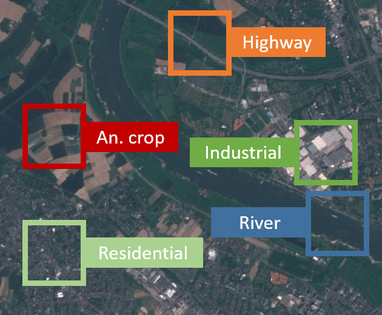
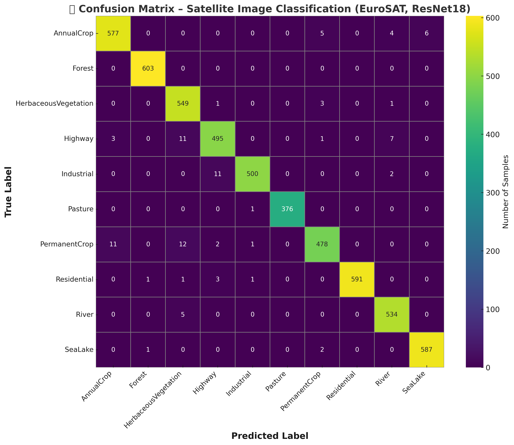

# 🛰️ Satellite-Image-Classification
🚀 Satellite Image Classification (EuroSAT + ResNet18)  This repository trains a CNN (ResNet18) to classify EuroSAT satellite images into 10 land-cover classes. It includes training, evaluation, plots, sample predictions and an animated GIF demo.

<p align="center">
  
</p>

---

## 📌 Project Overview
This project applies **Deep Learning (CNN)** to classify **satellite images** into 10 land cover classes using the **EuroSAT dataset**.  

🔹 **Why is this relevant to aerospace & aircraft?**
- 🚁 **UAVs / Drones** → Terrain awareness & autonomous flight planning  
- ✈️ **Aircraft Safety** → Detecting safe/unsafe landing zones  
- 🛰️ **Satellites** → Automated Earth observation, land-use monitoring  
- 🌍 **Disaster Response** → Flood, fire, and deforestation detection  

This work demonstrates how **AI + aerospace data** can be combined for real-world impact.  

---

## 📂 Dataset – EuroSAT
- **Source**: [EuroSAT Dataset (Kaggle)](https://www.kaggle.com/datasets/apollo2506/eurosat-dataset)  
- **Format**: RGB images (64×64 px, JPG)  
- **Classes (10)**:  
  `AnnualCrop, Forest, HerbaceousVegetation, Highway, Industrial, Pasture, PermanentCrop, Residential, River, SeaLake`  

✅ Already organized into folders → easy for PyTorch `ImageFolder` or custom dataset.  

---

## ⚙️ Methodology
1. **Preprocessing**
   - Resize → 224×224
   - Normalization (ImageNet mean/std)
   - Augmentation (random crops, flips)

2. **Model**
   - **ResNet18** pretrained on ImageNet  
   - Fine-tuned for **10-class classification**

3. **Training**
   - Optimizer: Adam (lr=1e-4)  
   - Loss: CrossEntropy  
   - Split: 80% training / 20% validation  

4. **Evaluation**
   - ✅ Accuracy, Precision, Recall, F1  
   - ✅ Confusion Matrix  
   - ✅ ROC Curves  
   - ✅ Training Curves  
   - ✅ Inference Time per image  

---

## 📊 Results

### 🔹 Confusion Matrix
<p align="center">
  
</p>


### 🔹 Model Predictions
<p align="center">
  
</p>

---

## 🚀 How to Run

### 1️⃣ Clone Repo & Install Requirements
```bash
git clone https://github.com/yourusername/satellite-image-classification.git
cd satellite-image-classification
pip install -r requirements.txt

2️⃣ Train Model
python train.py --root /kaggle/input/eurosat-dataset --subset EuroSAT --epochs 8 --bs 64
3️⃣ Evaluate Model
python evaluate.py --root /kaggle/input/eurosat-dataset --subset EuroSAT

🧩 Applications in Aerospace
Aircraft & UAVs: terrain recognition for flight safety
Satellites: onboard AI for land monitoring
Defense & Security: monitoring strategic zones
Climate Science: detect changes in vegetation, water, and urbanization

📌 Next Steps
Experiment with EfficientNet / Vision Transformers
Try EuroSAT Multispectral (13-band) with NDVI
Deploy as a Streamlit/Flask web app for interactive demo

🙌 Acknowledgements
Dataset: Helber et al. (2019)

Kaggle community
✨ With visuals, aerospace connection, and step-by-step usage, this README is both professional and easy to understand at first glance.
