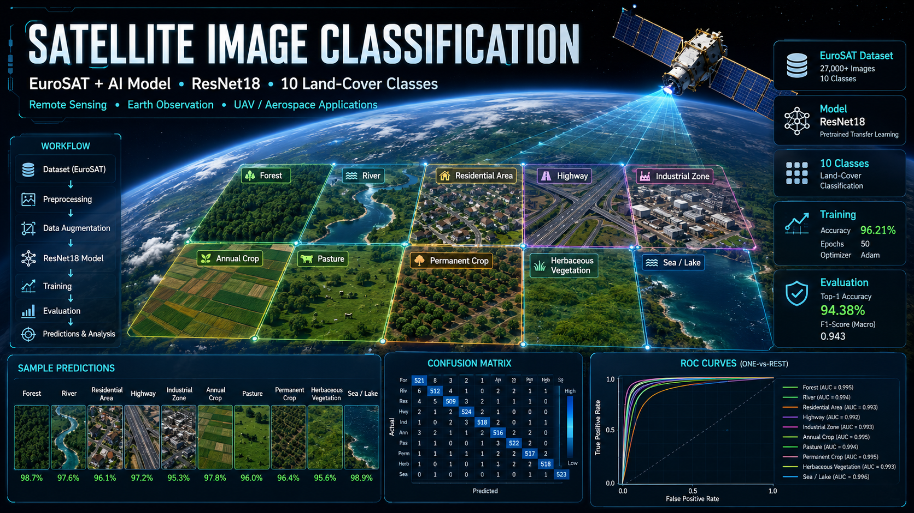
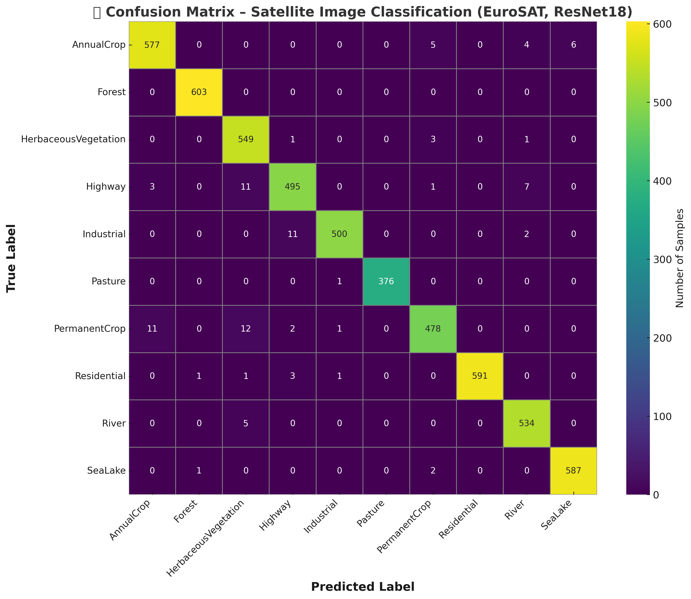

# 🛰️ Satellite-Image-Classification
🚀 Satellite Image Classification (EuroSAT + Ai Model)  This repository trains a CNN (ResNet18) to classify EuroSAT satellite images into 10 land-cover classes. It includes training, evaluation, plots, sample predictions and an animated GIF demo.

<p align="center">
  
</p>

---
## 🚩 Purpose
This repository demonstrates a **practical pipeline** to classify land cover from satellite imagery using deep learning (on the EuroSAT dataset). The goal is to show how AI can be applied to **real aerospace tasks** such as remote sensing, UAV/aircraft terrain awareness, and satellite onboard analytics.

**Key idea:** take satellite image tiles → run a trained CNN → get land-cover labels → use results for mapping, monitoring, or decision support.

---

## 🔎 Practical Uses & How It Fits Aerospace
This project is directly relevant to aerospace / aircraft programs in the following ways:

- **Earth observation & satellite missions**  
  - Automate land-cover mapping from satellite imagery for environmental monitoring, crop monitoring, and urban studies.
- **UAV / Drone operations**  
  - Real-time terrain classification for flight planning (identify safe landing zones, avoid restricted/unsafe terrain).
- **Aircraft safety & airspace management**  
  - Enhance situational awareness with updated land-cover maps, useful for emergency landing decisions or route planning.
- **Disaster response & humanitarian aid**  
  - Rapid classification to detect flooded zones, burned areas, or damaged infrastructure following natural disasters.

**Practical workflow example**
1. Acquire imagery (satellite tiles or UAV images).  
2. Preprocess (resize, normalize, georeference).  
3. Run the classifier (batch or real-time inference).  
4. Postprocess: aggregate tile labels into maps, overlay on GIS, trigger alerts or human review.  
5. Integrate outputs into flight control systems, mission planners, or monitoring dashboards.

---

## ✅ Features
- Preprocessing & augmentation (resize → 224×224, normalization, random crops/flip)  
- Transfer learning: ResNet18 pretrained on ImageNet, fine-tuned on EuroSAT  
- Training + evaluation pipeline with:  
  - Confusion matrix (high-res, annotated)  
  - ROC curves (per-class)  
  - Training/validation curves (accuracy & loss)  
  - Average inference time measurement  
- Visual outputs: sample predictions image, animated GIF of prediction frames  
- Simple scripts: `train.py`, `evaluate.py`, `make_gif.py` for reproducible runs  
- Extensible to multispectral `.tif` (NDVI, PCA) with a small adapter

## 📌 Project Overview
This project applies **Deep Learning (CNN)** to classify **satellite images** into 10 land cover classes using the **EuroSAT dataset**.  

🔹 **Why this project?**
- 🚁 **UAVs / Drones** → Terrain awareness & autonomous flight planning  
- ✈️ **Aircraft Safety** → Detecting safe/unsafe landing zones  
- 🛰️ **Satellites** → Automated Earth observation, land-use monitoring  
- 🌍 **Disaster Response** → Flood, fire, and deforestation detection  


---

## 📂 Dataset – EuroSAT
- **Source**: [EuroSAT Dataset (Kaggle)](https://www.kaggle.com/datasets/apollo2506/eurosat-dataset)  
- **Format**: RGB images (64×64 px, JPG)  
- **Classes (10)**:  
  `AnnualCrop, Forest, HerbaceousVegetation, Highway, Industrial, Pasture, PermanentCrop, Residential, River, SeaLake`  

✅ Already organized into folders → easy for PyTorch `ImageFolder` or custom dataset.  

---

## ⚙️ Methodology
1. **Preprocessing**
   - Resize → 224×224
   - Normalization (ImageNet mean/std)
   - Augmentation (random crops, flips)

2. **Model**
   - **ResNet18** pretrained on ImageNet  
   - Fine-tuned for **10-class classification**

3. **Training**
   - Optimizer: Adam (lr=1e-4)  
   - Loss: CrossEntropy  
   - Split: 80% training / 20% validation  

4. **Evaluation**
   - ✅ Accuracy, Precision, Recall, F1  
   - ✅ Confusion Matrix  
   - ✅ ROC Curves  
   - ✅ Training Curves  
   - ✅ Inference Time per image  

---

## 📊 Results

### 🔹 Confusion Matrix
<p align="center">
  
</p>


### 🔹 Model Predictions
<p align="center">
  
</p>

---

## 🚀 How to Run

### 1️⃣ Clone Repo & Install Requirements
```bash
git clone https://github.com/yourusername/satellite-image-classification.git
cd satellite-image-classification
pip install -r requirements.txt

2️⃣ Train Model
python train.py --root /kaggle/input/eurosat-dataset --subset EuroSAT --epochs 8 --bs 64
3️⃣ Evaluate Model
python evaluate.py --root /kaggle/input/eurosat-dataset --subset EuroSAT

🧩 Applications in Aerospace
Aircraft & UAVs: terrain recognition for flight safety
Satellites: onboard AI for land monitoring
Defense & Security: monitoring strategic zones
Climate Science: detect changes in vegetation, water, and urbanization

📌 Next Steps
Experiment with EfficientNet / Vision Transformers
Try EuroSAT Multispectral (13-band) with NDVI
Deploy as a Streamlit/Flask web app for interactive demo

🙌 Acknowledgements
Dataset: Helber et al. (2019)

Kaggle community
✨ With visuals, aerospace connection, and step-by-step usage, this README is both professional and easy to understand at first glance.
